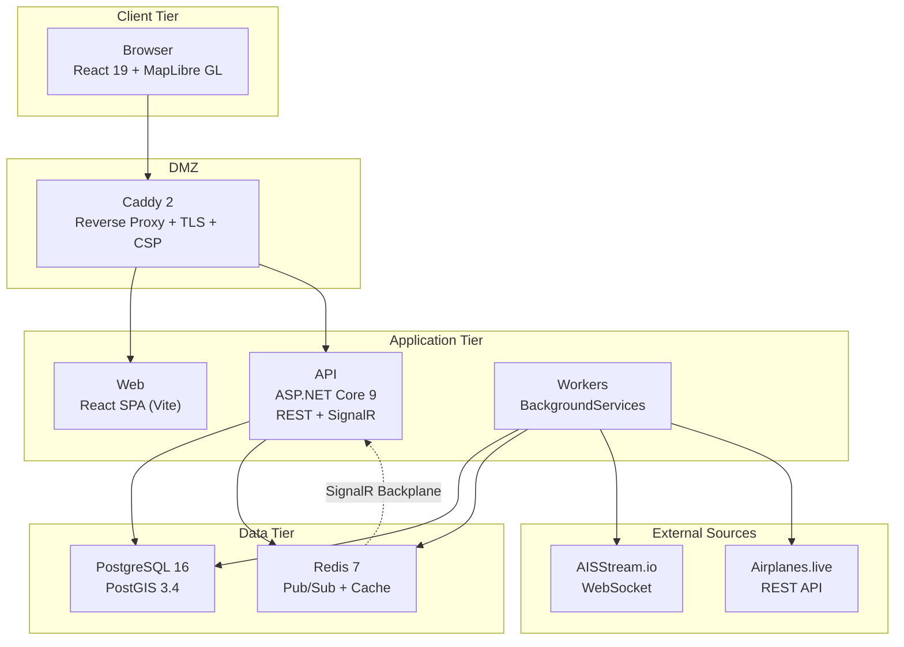
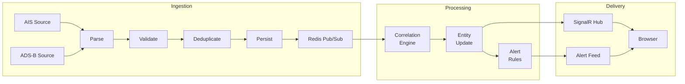

# SentinelMap

> OSINT aggregation and correlation platform fusing real-time maritime (AIS) and aviation (ADS-B) data into a unified Common Operating Picture.

**Author:** Luke Baard — [LinkedIn](https://www.linkedin.com/in/lukebaard) | [GitHub](https://github.com/baardie)

SentinelMap is a full-stack systems engineering demonstration: a defence-grade situational awareness platform that ingests, correlates, and presents multi-source track data in real time. It demonstrates dual-source entity correlation, a classification-enforced data model, production-quality security architecture, and an air-gappable deployment.

## Quick Start

### Prerequisites

- Docker Desktop (or Docker Engine + Compose v2)
- Git
- AISStream.io API key (free — [register here](https://aisstream.io)) for live vessel tracking

### Run

```bash
git clone https://github.com/baardie/SentinelMap.git
cd SentinelMap
cp .env.example .env
# Add your AISStream API key to .env
docker compose up
```

Open `http://localhost` and log in. Live AIS vessel data and ADS-B aircraft data will begin streaming within seconds.

### Demo Accounts

| Email | Role | Clearance | Password |
|---|---|---|---|
| admin@sentinel.local | Admin | SECRET | `SentinelDemo123!` |
| analyst@sentinel.local | Analyst | OFFICIAL-SENSITIVE | `SentinelDemo123!` |
| viewer@sentinel.local | Viewer | OFFICIAL | `SentinelDemo123!` |

Override the seed password via `SENTINELMAP_SEED_PASSWORD` in `.env`.

### Data Modes

| Mode | Description | Required |
|---|---|---|
| `Live` (default) | Real AIS via AISStream.io + real ADS-B via Airplanes.live | `AISSTREAM_API_KEY` for AIS |
| `Simulated` | Deterministic simulated vessels and aircraft — no external calls | None |
| `Hybrid` | Live data with simulated fallback on connection failure | `AISSTREAM_API_KEY` for AIS |

Set `SENTINELMAP_DATA_MODE` in `.env`. Per-source overrides available via `SENTINELMAP_AIS_MODE` and `SENTINELMAP_ADSB_MODE`. ADS-B requires no API key.

## Features

### Real-Time Dual-Source Tracking

- **Maritime (AIS):** Live vessel tracking via AISStream.io WebSocket. Heading-oriented vessel icons colour-coded by type (cargo, tanker, passenger, fishing, tug, pilot, military). Entity detail panel shows MMSI, flag state (200+ MID prefixes), vessel type, destination, ETA, dimensions, draught, IMO, callsign.
- **Aviation (ADS-B):** Live aircraft tracking via Airplanes.live REST polling. Aircraft type codes (B738, A320, etc.), registration, squawk, altitude, vertical rate. Military aircraft flagged via dbFlags — rendered orange on map. Emergency squawk detection (7500/7600/7700) triggers instant Critical alerts.

### Entity Correlation Engine

Hot-path Redis cache resolves 90%+ of observations without a database query. Cold-path correlation uses Jaro-Winkler fuzzy name matching (threshold 0.75), speed-scaled spatial radius, and noisy-OR confidence aggregation. Mid-confidence matches (0.3–0.6) enter an analyst review queue for manual approve/reject.

### Alerting System (8 alert types)

| Alert | Severity | Trigger |
|---|---|---|
| Geofence Breach | High | PostGIS `ST_Within` with Redis set membership diffing |
| Watchlist Match | Critical | O(1) Redis hash lookup with per-entity debounce |
| AIS Dark | High | Configurable silence timeout (default 900s) |
| Speed Anomaly | Medium | Type-specific thresholds (>50kt vessel, >600kt aircraft) |
| Transponder Swap | High | MMSI/ICAO identifier change detection |
| Correlation Link | Low | New data source linked to existing entity |
| Route Deviation | Medium | Rolling 30-heading circular mean, >60° deviation threshold |
| Emergency Squawk | Critical | 7500 (hijack), 7600 (comms failure), 7700 (emergency) |

Alerts delivered via SignalR in real time. Filterable by type and severity. Webhook notifications with HMAC-SHA256 signed payloads.

### Map Intelligence Layers

- **AIS Base Stations** — live positions from AIS Message Type 4
- **Aids to Navigation** — 31 AtoN types (buoys, beacons, lights, RACON, wrecks) from AIS Message Type 21
- **UK Airports** — 20 airports with ICAO codes
- **Military Installations** — 15 UK military bases (RAF, HMNB, BAE, AWE)
- **Restricted Airspace** — CTRs, danger areas, MATZ, prohibited zones
- **Custom Structures** — user-placed command posts, checkpoints, observation points
- **Safety Broadcasts** — AIS safety messages displayed in dedicated TopBar panel
- **City Labels** — 50 UK+Ireland locations with zoom-dependent visibility

All layers toggleable via the LAYERS panel. Every feature clickable for detail panel.

### Interactive Geofencing

Drag-and-drop geofence creation: polygon draw mode or circle with configurable radius. Custom colours, fence types (Entry/Exit/Both), click-to-edit existing zones. Airspace zones (CTR, Danger, MATZ, Prohibited) rendered as styled overlays.

### Track History & Replay

Historical track API with timeline scrubber. Play/pause with 1x/2x/5x/10x speed. Animated replay showing full track (faded), traversed path (bright blue), and interpolated position marker. Dead reckoning prediction layer extrapolates future positions from current heading and speed.

### Classification System

Three-tier mock classification: `OFFICIAL`, `OFFICIAL-SENSITIVE`, `SECRET`. EF Core global query filters enforce clearance at the ORM layer. Workers use an unfiltered `SystemDbContext`. All exports include classification watermarks. UI banner reflects authenticated user's clearance.

### Security

- **Authentication:** RS256 JWT, 15-minute access tokens, refresh token rotation with family tracking
- **Authorisation:** RBAC (Viewer/Analyst/Admin) via named ASP.NET Core policies
- **Rate Limiting:** Auth: 10/min, API reads: 100/min
- **Audit:** Two-path logging — sync for security events, async for operational
- **Sessions:** Admin UI for active session management with force-revoke
- **Transport:** CSP, CORS allowlist, Docker network isolation, Caddy TLS termination

### Export

CSV and GeoJSON export with classification watermark. Exports include all active entities with position, speed, heading, status, and type.

## Architecture

### System Diagram



### Data Pipeline



### Tech Stack

| Layer | Technology |
|---|---|
| Backend | .NET 9, ASP.NET Core, EF Core 9, FluentValidation |
| Frontend | React 19, TypeScript, Vite, Tailwind CSS v4, MapLibre GL JS, shadcn/ui |
| State Management | React Context + Hooks — server-pushed via SignalR (no client polling) |
| Database | PostgreSQL 16 + PostGIS 3.4 (spatial queries, partitioned tables) |
| Cache / Messaging | Redis 7 (pub/sub, dedup, geofence membership, SignalR backplane) |
| Reverse Proxy | Caddy 2 (TLS, CSP headers, WebSocket proxying) |
| Basemap | PMTiles + Protomaps (self-hosted vector tiles, fully air-gappable) |

### Frontend State Architecture

No Redux or external state library — state flows from the server via SignalR, not from client-side stores:

- **`AuthContext`** — JWT lifecycle (login, refresh, logout), user role/clearance, auto-refresh timer
- **`ToastContext`** — transient notification queue with auto-dismiss
- **`useTrackHub`** — SignalR connection to `/hubs/tracks`, receives `TrackUpdate` and `AlertTriggered` events, maintains a `Map<entityId, TrackFeature>` for O(1) upserts
- **Map layers** — each layer component (`MaritimeTrackLayer`, `AviationTrackLayer`, `GeofenceLayer`, etc.) owns its own MapLibre sources/layers via `useEffect` lifecycle, reading props from the parent `MapContainer`
- **Entity detail / enrichment** — fetched on-demand from REST API when a user clicks an entity, not pre-loaded

This is deliberate: in a real-time COP, the server is the source of truth. SignalR pushes ~500 updates/second; a client-side store would just be a stale mirror. React's built-in state + context is sufficient when the server drives updates.

## Project Structure

```
SentinelMap/
├── src/
│   ├── SentinelMap.Api/            # REST API + SignalR hub + auth endpoints
│   ├── SentinelMap.Workers/        # Background services (ingestion, correlation, alerting)
│   ├── SentinelMap.Infrastructure/ # Data access, connectors, pipeline, correlation rules
│   ├── SentinelMap.Domain/         # Entities, interfaces, message types
│   └── SentinelMap.SharedKernel/   # Enums, DTOs, shared interfaces
├── client/                         # React frontend (Vite + TypeScript)
├── tests/                          # xUnit test projects (98 tests)
├── docs/
│   └── THREAT_MODEL.md             # STRIDE analysis, risk matrix
├── scripts/                        # PMTiles download, tooling
├── docker-compose.yml              # Production six-service deployment
├── docker-compose.override.yml     # Dev overrides (exposed db/redis ports)
└── Caddyfile                       # Reverse proxy and security headers
```

## Development

### Prerequisites

- .NET 9 SDK
- Node.js 22+
- Docker Desktop

### Local Development

```bash
# Start infrastructure only
docker compose up db redis -d

# API (http://localhost:5000)
cd src/SentinelMap.Api && dotnet run

# Workers
cd src/SentinelMap.Workers && dotnet run

# Frontend (http://localhost:5173)
cd client && npm install && npm run dev
```

### Testing

```bash
dotnet test SentinelMap.slnx
# 98 tests across 3 projects
```

### PMTiles Basemap

The vector basemap is downloaded separately via the Protomaps planet build. Choose a preset based on your area of interest:

| Preset | Coverage | Max Zoom | Size | Command |
|--------|----------|----------|------|---------|
| `uk` | UK + Ireland **(default)** | 12 | ~400 MB | `bash scripts/download-pmtiles.sh` |
| `mersey` | Liverpool / Mersey estuary | 14 | ~75 MB | `bash scripts/download-pmtiles.sh mersey` |
| `europe` | Western Europe | 10 | ~1.5 GB | `bash scripts/download-pmtiles.sh europe` |
| `world` | Global | 8 | ~2 GB | `bash scripts/download-pmtiles.sh world` |

Higher zoom = more street-level detail. Lower zoom presets cover wider areas but less detail when zoomed in. The `uk` preset is recommended for most users.

## Security

See [Threat Model](docs/THREAT_MODEL.md) for the full STRIDE analysis covering 17 identified threats across 5 trust boundaries, with risk matrix and mitigation mapping.

## License

MIT
